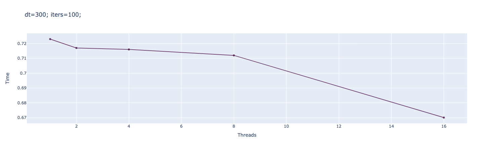
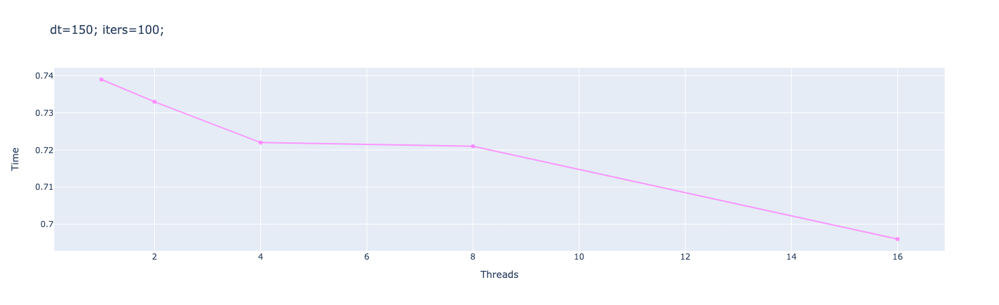
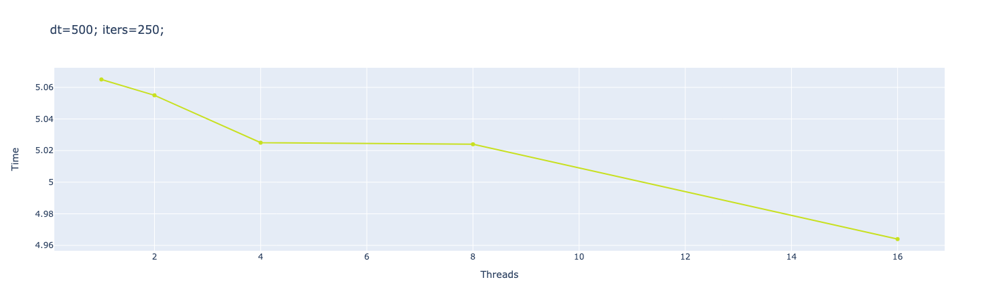
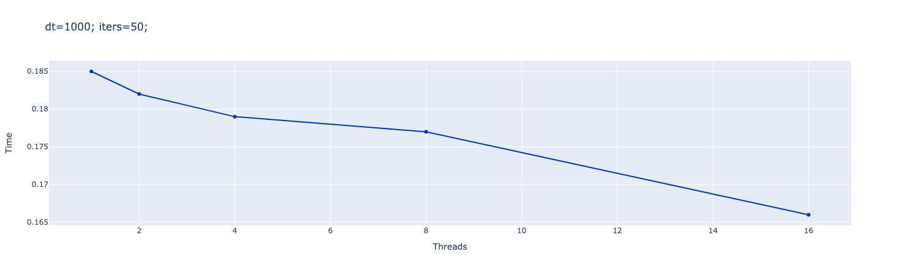
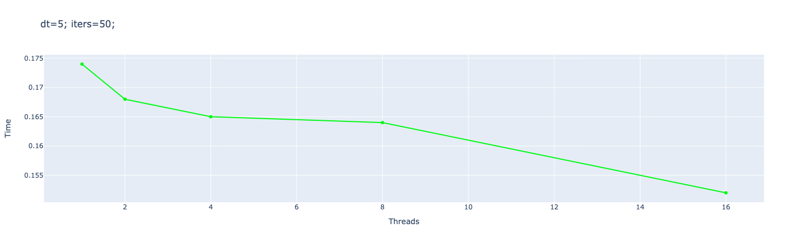
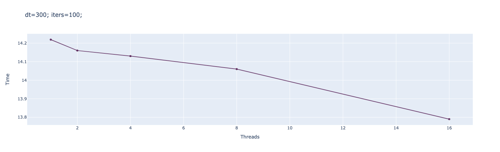
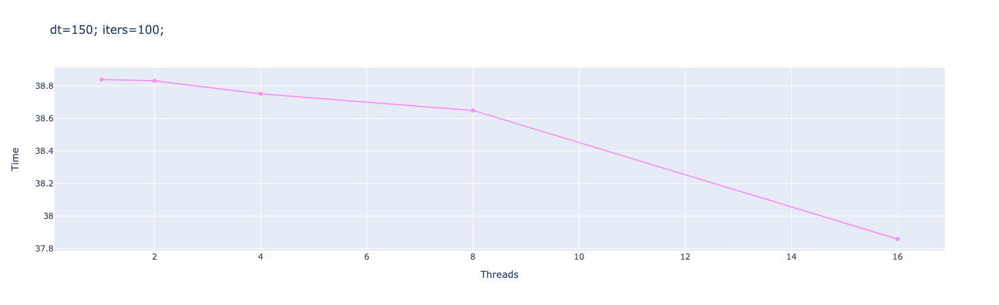
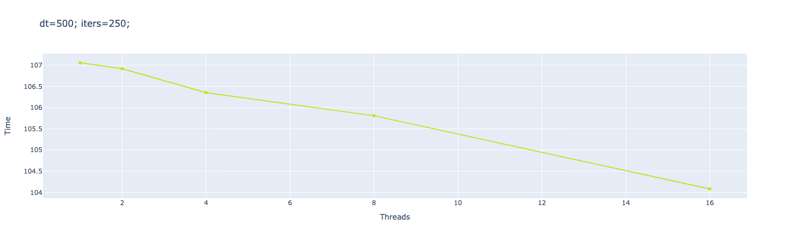
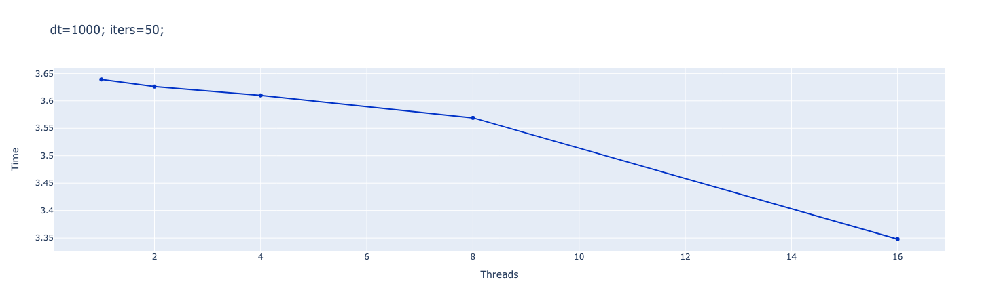
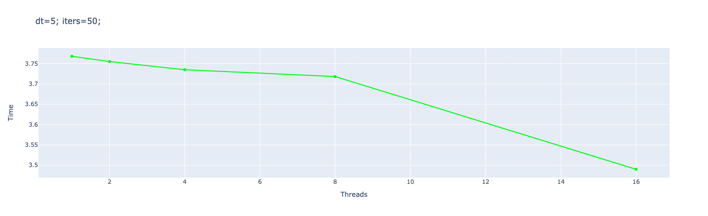

# Parallel Programming. Lab 1. N-тел.
**19ПИ-2**
Выполнили:

* Ожиганова Полина
* Конина Татьяна
* Хорошавина Екатерина


## **Run**
```
cd "./mystery-cpp-task/" && g++ task.cpp -o task -lpthread && "./mystery-cpp-task/"task 300 100 2 data/test128.txt data/output128.csv
```

## **Main idea**
В задаче производится распараллеливание подсчетов новых координат тел и их скоростей в определенный момент времени.
У нас есть один общий ресурс с многопоточностью (очередь), чтобы избежать проблем с синхронизацией - были использованы мьютексы и переменные условия.

```c++
pthread_mutex_lock(&queuing);
// помещаем задачи в очередь
queuing_jobs = num_body, num_done = 0;
pthread_mutex_unlock(&queuing);
```

```c++
void *worker(void *param)
{
    while (true)
    {
        pthread_mutex_lock(&queuing);
        ...
        int i = --queuing_jobs;
        // блокируем критически важную секцию, а именно изменение координат точек
        pthread_mutex_unlock(&queuing);
        ...
        pthread_mutex_lock(&queuing);
        // во время вычисления мы обновляем кол-во задач которые мы выполнили
        num_done++;
        ...
        pthread_mutex_unlock(&queuing);
    }
}
```
При блокировке мьютекса мы помещаем все задачи в очередь, обновляем их индексы и счетчик завершенных задач.

Когда очередь задач готова - мы будим все ожидающие потоки с помощью broadcast() и побуждаем их выполнять работу. Далее основной поток должен дождаться завершения всех задач , поэтому он выполняет условие ожидания, а позже будет уведомлен и разбужен, чтобы выполнить последнюю задачу.

```c++
for (int i = 0; i < iters; ++i) {
    // есть общий ресурс - очередь задач и мы ее постоянно лочим, чтобы никто ее не портил
    pthread_mutex_lock(&queuing);
    ...
    // будим все воркеры
    // чтобы они начали выполнять задачи
    pthread_cond_broadcast(&processing);

    // главный поток будет ждать пока все задачи не будут выполнены
    // позже он будет разбужен последним воркером в этой итерации
    // и таким образом пойдет на новый цикл итераций
    pthread_cond_wait(&iter_fin, &queuing);
    pthread_mutex_unlock(&queuing);
}
```

## **Experiments**

### **128 points**
| threads | dt=300 / iters=100 | dt=150 / iters=100 | dt=500 / iters=250 | dt=1000 / iters=50 | dt=5 / iters=50 |
|-------| ---------------| ------------------|----------------------------------|----------------------------------|----------------------------------|
| 1 | 0.723 | 0.739 | 5.065 | 0.185 | 0.174 |
| 2 | 0.717⁣ ⁣| 0.733 ⁣⁣| 5.055 ⁣| 0.182 | 0.168 |
| 4 | 0.716⁣ ⁣| 0.722⁣ ⁣| 5.025 ⁣| 0.179 | 0.165 |
| 8 | 0.712⁣ ⁣| 0.721 ⁣| 5.024⁣⁣ ⁣| 0.177 | 0.164 |
| 16 | 0.67 ⁣|⁣ 0.696 ⁣| 4.964 ⁣| 0.166 | 0.152 |

**Charts**

<p align="center">
  
</p>

<p align="center">
  
</p>

<p align="center">
  
</p>

<p align="center">
  
</p>

<p align="center">
  
</p>

### **512 points**
| threads | dt=300 / iters=100 | dt=150 / iters=100 | dt=500 / iters=250 | dt=1000 / iters=50 | dt=5 / iters=50 |
|-------| ---------------| ------------------|----------------------------------|----------------------------------|----------------------------------|
| 1 | 14.219 | 38.839 | 107.058 | 3.639 | 3.768 |
| 2 | 14.16⁣ ⁣| 38.831 ⁣⁣| 106.918 ⁣| 3.626 | 3.755  |
| 4 | 14.13⁣ ⁣| 38.751⁣ ⁣| 106.354⁣ ⁣| 3.61 | 3.735 |
| 8 | 14.06⁣ ⁣| 38.649 ⁣| 105.809⁣⁣ ⁣| 3.569 | 3.718 |
| 16 | 13.79 ⁣|⁣ 37.859 ⁣| 104.083 ⁣| 3.348 | 3.49 |

**Charts**

<p align="center">
  
</p>

<p align="center">
  
</p>

<p align="center">
  
</p>

<p align="center">
  
</p>

<p align="center">
  
</p>


**Conclusion**

Использование мьютексов для синхронизации потоков и переменных условия оптимизирует вычисления алгоритма N-тел. При одинаковом количестве потоков наблюдается прямая зависимость времени выполнения программы от количества итераций. Как видно из графиков - оптимальное кол-во потоков для каждого эксперимента было 16.

